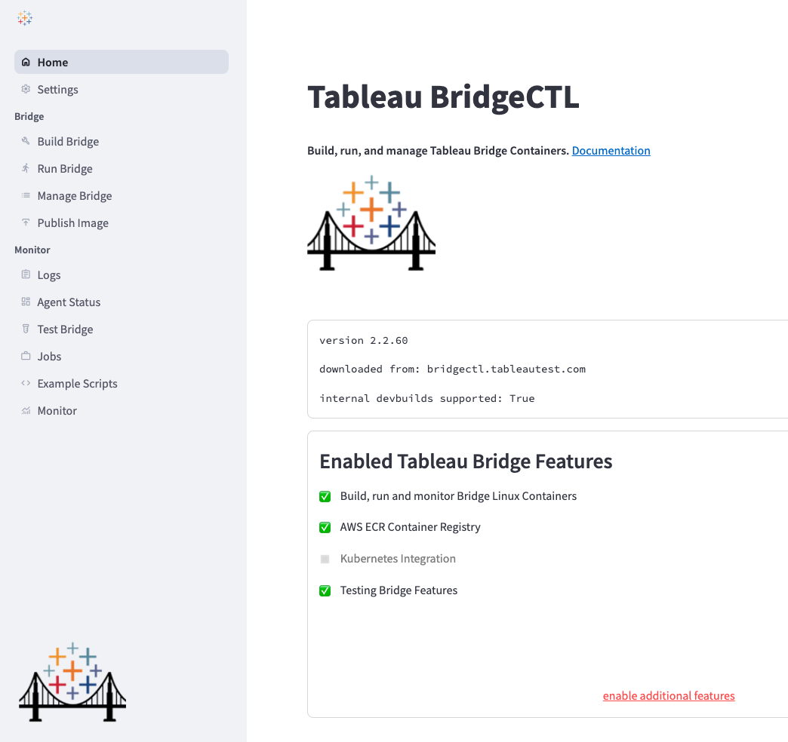
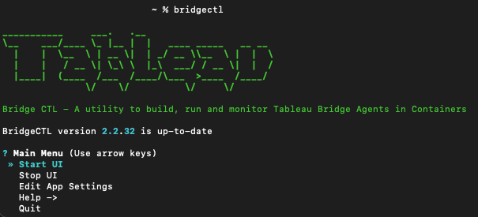
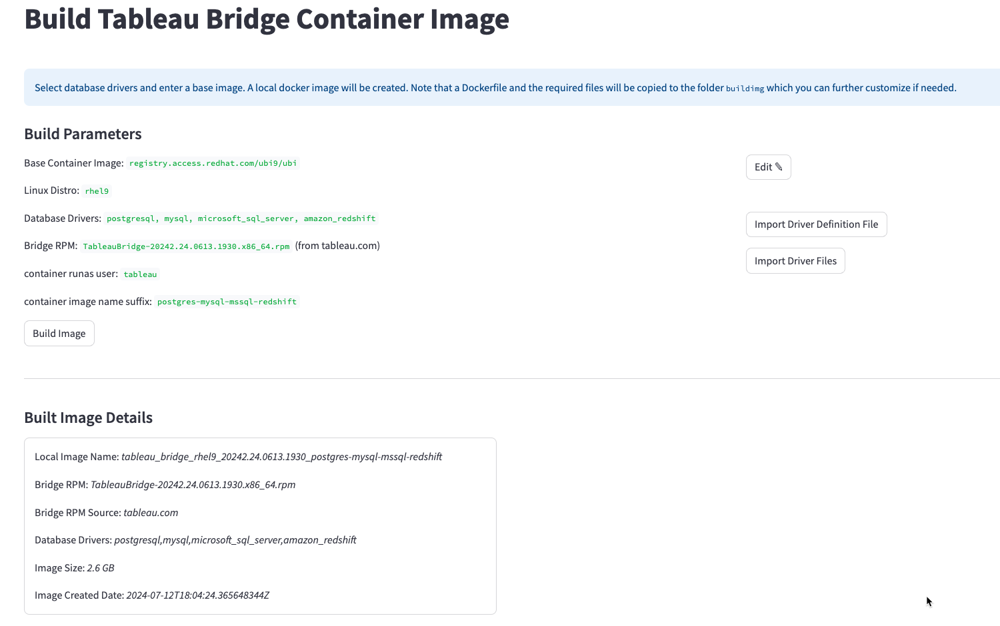
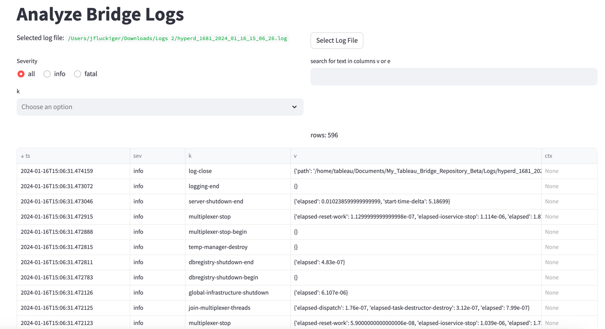
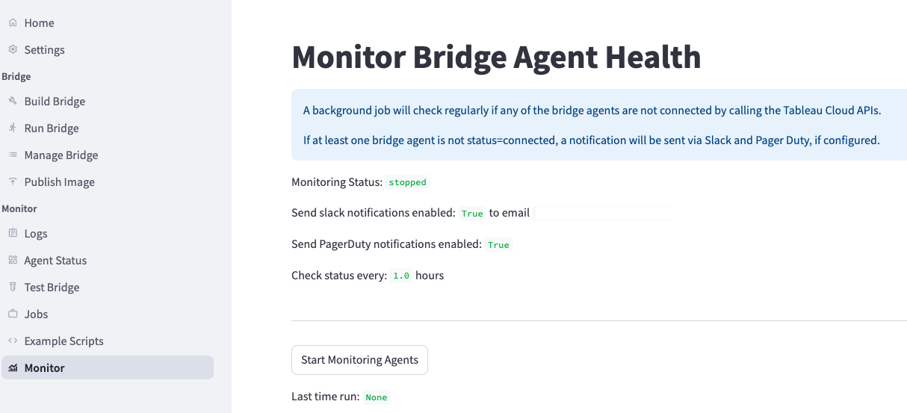
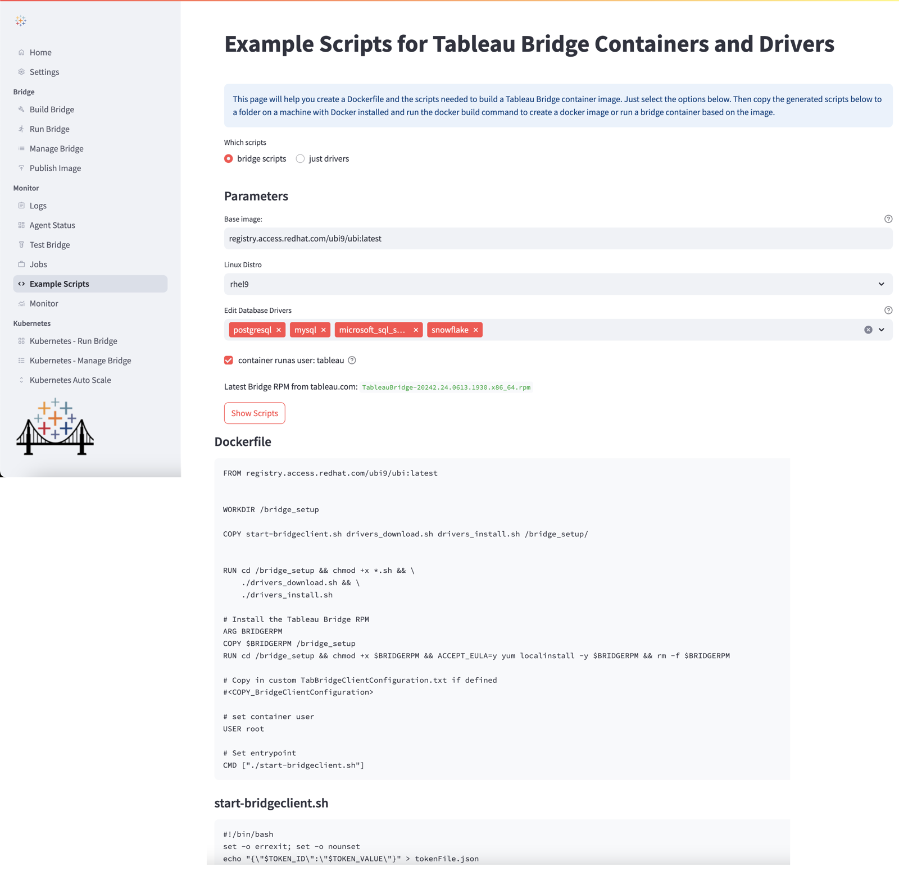

# Tableau BridgeCTL
BridgeCTL is a local command-line utility for Tableau Bridge. It solves many of the pain points faced by Bridge administrators.

[](https://www.tableau.com/support-levels-it-and-developer-tools)
[](https://github.com/tableau/bridgectl/blob/main/LICENSE.txt)

### Introduction
BridgeCTL will help you build your Tableau Bridge Linux container images including downloading and 
installing the right database drivers and bridge .rpm installer. Then it will help you easily configure and 
run your bridge containers in Docker or Kubernetes with the correct bridge settings (Tableau sitename, pool, PAT Token, etc.). 
It will help you monitor the status and configuration of your running bridge agents and to also help analyze your bridge logs. 
BridgeCTL can be installed on Linux, Windows or Mac.

### Setup
BridgeCTL is easy to install. Just download and run the bridgectl_setup.py script using the following commands:

```
curl -OL https://github.com/tab-se/bridgectl/releases/download/setup/bridgectl_setup.py
python bridgectl_setup.py
```

### Requirements
- Python >= 3.10
- Docker Desktop
- BridgeCTL works on Windows, Linux or Mac

Note python 3.10 or greater is required. Please use the appropriate python command on your machine to run the setup script, for example instead of "python" you may need to use "python3" or "python3.11". 
The BridgeCTL setup script will create a folder "bridgectl" and a python virtual environment named tabenv. It will create a shortcut function `bridgectl` so that you can conveniently use that global command from the terminal. 

Optional Requirements
- If you would like to run bridge agents containers in Kubernetes you will need access to AWS Elastic Container Registry and a Kubernetes cluster.

### Quickstart Demo


### Features
- Build Tableau Bridge docker container images
  - Download and install the bridge rpm and selected database drivers in the image.
  - Follow best practices for building containers.
- Run bridge containers in Docker
- Reports
  - Display Jobs Report
  - Display Bridge Agent Status
- Analyze bridge logs
  - Log viewer with ability to filter and sort logs
  - Analyze logs from local docker containers, local disk or from kubernetes containers (pods)
- Run bridge containers in Kubernetes
  - After importing your kubeconfig file, you can spin up bridge agent containers in a Kubernetes cluster
- Manage bridge containers in Docker or Kubernetes
  - View configuration settings of bridge containers or delete bridge containers
  - View current bridge agent activity (standard output logs)
  - Show snapshot metrics about resource utilization

### Terms of Use
This repo contains utilities and source code example files for creating and running Tableau bridge Linux containers. These scripts may be useful but are unsupported. Please get help from other users on the Tableau Community Forums.

### Documentation for Tableau Bridge
See [official Tableau documentation](https://help.tableau.com/current/online/en-us/to_bridge_linux_install.htm) for creating bridge containers on Linux


### Release Notes
[Release Notes](docs/RELEASE_NOTES.md)

<br><br><br>
### User interface screenshots
Home



Command-line Interface

__

Build Bridge Container Images


Analyze Logs


Monitor Bridge Agent Health


Autoscale Bridge Pods in Kubernetes


Example Dockerfile Scripts

